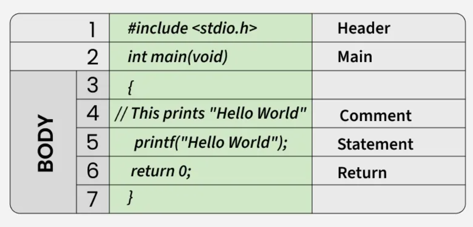

# C_Overview

### *C is a general purpose procedural programming language developed by Dennis M. Ritchie in 1972 at Bell laboratories of AT&T labs , it was initially developed for system programming and to develop the UNIX operating system.*

### Why learn C ?

* Syntax of some programming languages such as Java, PHP and JavaScript have been derived from C hence learning C helps to understand modern programming languages much easier and also gain a deeper understanding of programming.

* C is used in operating systems, embedded systems, compilers, databases, networking, game engines and many real time systems which utilise the resource environment and low level nature of C.

### Writing the first program in C :-

Below is a simple program showing the structure/syntax of C :-

```C
#include <stdio.h>
int main(void)
{
    // This prints "Hello World"
    printf("Hello World");
    return 0;  
}
/* Output -> Hello World*/
```

### Structure of a C Program :-



**Line 1 (Header file inclusion) :-**

The first line has the header file which contains various function declarations and macro definitions which are to be shared with several source files, the # is a preprocessor directive which is invoked by a compiler , it basically copies the contents of the header file namely stdio.h and pastes it into our source code.

Some of the C Header files:

* stddef.h - Defines several useful types and macros. 
* stdint.h - Defines exact width integer types.
* stdio.h - Defines core input and output functions
* stdlib.h - Defines numeric conversion functions, pseudo-random number generator, and memory allocation
* string.h - Defines string handling functions
* math.h - Defines common mathematical functions*

**Line 2 (Main method declaration) :-**

It is the entry point of a C program implying that program execution normally begins with the first line of the main function , the open brackets indicate that the main function doesn't take any parameters and its return type indicate the status of completion of our program.

**Line 3 to Line 6 (Body of the main function) :-**

Every C method/function must start and end with curly brackets {} , the main function can contain anything such as sorting, searching, hashing, making a Menu-Driven program etc.

**Line 7 (Comments) :-**

Comments are basically used for noting/providing documentation for our source code , comments are ignored by the compiler and are not a part of the executable program.

**Line 4 (Print statement) :-**

Statements are instructions given to the compiler during execution, they are always terminated by a semi-colon (;) . Here the compiler is given an instruction to display the message ("Hello World").

**Line 5 (Return Statement) :-**

It is used at the end of our main function, a return statement typically depends on the return type and value of the given function. The value of a return statement determines whether our program completed successfully or not. 

For example int main has an integer return type hence we can return either 0 or 1, with 0 meaning successfull completion of our program.

### Difference between C and C++ :-

|Feature|C|C++|
|-------|-|---|
|Paradigm|Procedural|Procedural,Object-Oriented,Generic|
|Object Oriented Programming|Not supported|supports OOP with concepts like polymorphism, classes, inheritance, abstraction|
