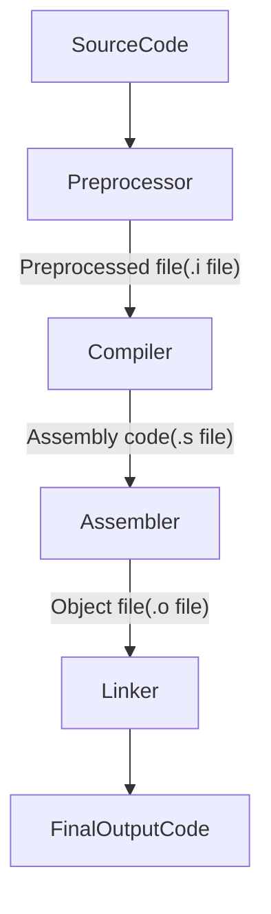

## C Compilation Process :-

#### Compilation begins from source file which is then preprocessed , compiled , assembled and then finally executed.

## What happens during compilation?
### The source code is compiled to an executable which undergoes the following stages :-
1) **Pre-processing.**
1) **Compiling.**
1) **Assembling.**
1) **Linking.**

### 1) **Pre-processing** :-
### It involves various processes like:-
* creation of filename.i(.i file)
* Expansion of macros
* Expansion of included file
* Removal of comments
* Conditional Compilation

#### In the end our code is still preserved.
* printf contains a/b instead of divide(a,b)
* &lt;stdio.h&gt; isn't seen as the header file itself is inside our compiled file instead of the preprocessor directive.