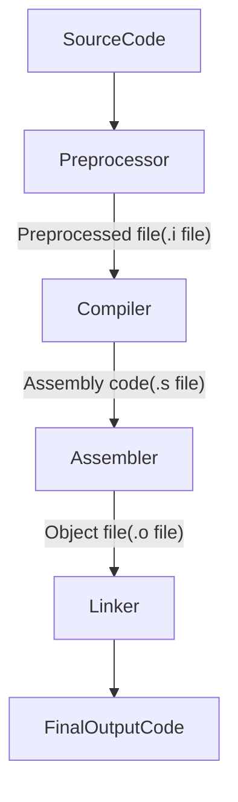

### C Compilation Process :-

##### Compilation begins from source file which is then preprocessed , compiled , assembled and then finally executed.

```mermaid
%%{init: {'theme': 'default', 'themeCSS': '.edgeLabel { background-color: transparent; padding: 0; }'}}%%
graph TD
    A[SourceCode]-->B[Preprocessor]
    B--Preprocessed file(.i file)-->C[Compiler]
    C--Assembly code(.s file)-->D[Assembler]
    D--Object file(.o file)-->E[Linker]
    E-->F[FinalOutputCode]
```